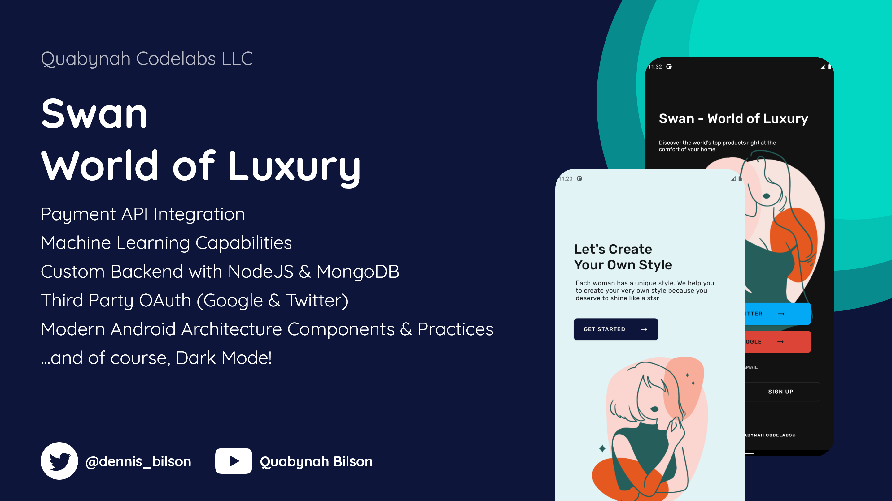
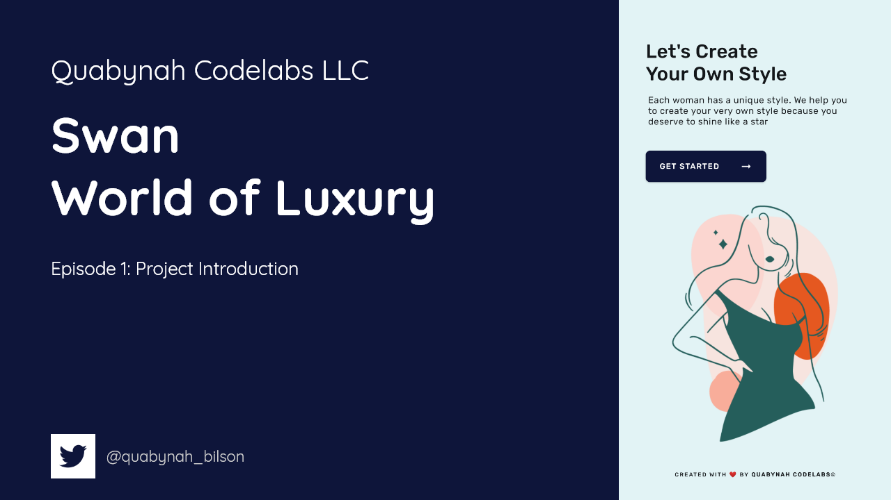
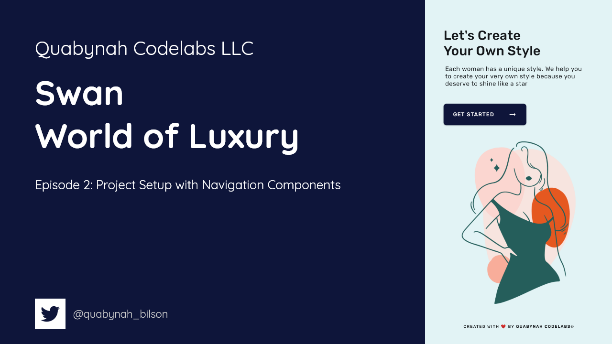

# Swan (World of Luxury)

An e-commerce app illustrating Android development best practices with Android Jetpack among others.

## Introduction

Swan is an e-commerce platform for an imaginary store called "World of Luxury". This app will have/use:

- [Stripe][100] - Payment API integration
- [Firebase ML Kit][101] - Machine learning capabilities for recommending products to buy based on scanned images
- [MongoDB][102] - A backend created in NodeJS and powered by MongoDB
- [Android Jetpack][103] - Modern Android architecture components

## Libraries Used

- [Foundation][0] - Components for core system capabilities, Kotlin extensions and support for
  multidex and automated testing.
  - [AppCompat][1] - Degrade gracefully on older versions of Android.
  - [Android KTX][2] - Write more concise, idiomatic Kotlin code.
  - [Test][4] - An Android testing framework for unit and runtime UI tests.
- [Architecture][10] - A collection of libraries that help you design robust, testable, and
  maintainable apps. Start with classes for managing your UI component lifecycle and handling data
  persistence.
  - [Data Binding][11] - Declaratively bind observable data to UI elements.
  - [Lifecycles][12] - Create a UI that automatically responds to lifecycle events.
  - [LiveData][13] - Build data objects that notify views when the underlying database changes.
  - [Navigation][14] - Handle everything needed for in-app navigation.
  - [Room][16] - Access your app's SQLite database with in-app objects and compile-time checks.
  - [ViewModel][17] - Store UI-related data that isn't destroyed on app rotations. Easily schedule
    asynchronous tasks for optimal execution.
  - [WorkManager][18] - Manage your Android background jobs.
- [UI][30] - Details on why and how to use UI Components in your apps - together or separate
  - [Animations & Transitions][31] - Move widgets and transition between screens.
  - [Fragment][34] - A basic unit of composable UI.
  - [Layout][35] - Lay out widgets using different algorithms.
- Third party
  - [Glide][90] for image loading
  - [Kotlin Coroutines][91] for managing background threads with simplified code and reducing needs for callbacks

[0]: https://developer.android.com/jetpack/components
[1]: https://developer.android.com/topic/libraries/support-library/packages#v7-appcompat
[2]: https://developer.android.com/kotlin/ktx
[4]: https://developer.android.com/training/testing/
[10]: https://developer.android.com/jetpack/arch/
[11]: https://developer.android.com/topic/libraries/data-binding/
[12]: https://developer.android.com/topic/libraries/architecture/lifecycle
[13]: https://developer.android.com/topic/libraries/architecture/livedata
[14]: https://developer.android.com/topic/libraries/architecture/navigation/
[16]: https://developer.android.com/topic/libraries/architecture/room
[17]: https://developer.android.com/topic/libraries/architecture/viewmodel
[18]: https://developer.android.com/topic/libraries/architecture/workmanager
[30]: https://developer.android.com/guide/topics/ui
[31]: https://developer.android.com/training/animation/
[34]: https://developer.android.com/guide/components/fragments
[35]: https://developer.android.com/guide/topics/ui/declaring-layout
[90]: https://bumptech.github.io/glide/
[91]: https://kotlinlang.org/docs/reference/coroutines-overview.html
[100]: https://stripe.com/docs/mobile/android/basic
[101]: https://firebase.google.com/docs/ml-kit/android/label-images
[102]: https://www.mongodb.com/
[103]: https://developer.android.com/jetpack/components
[200]: https://youtu.be/ebD5poqW2wM
[201]: https://youtu.be/UA5OpjqJNQk
[202]: https://youtu.be/P9tGUNzFNPM
[202]: https://youtu.be/4A-T5Mvq80U

<!-- [203]:  -->

## YouTube

[Episode 1: Swan - Project Introduction][200]

[Episode 2: Swan - Project Setup With Navigation Components][201]

[Episode 3: Swan - Designing our Welcome Page][202]

[Episode 4: Swan - Designing our Authentication Page][203]

## Support

- Stack Overflow:
  - http://stackoverflow.com/questions/tagged/android
  - http://stackoverflow.com/questions/tagged/android-jetpack

If you've found an error in this sample, please file an issue:
https://github.com/Quabynah-Codelabs/world-of-luxury-ecommerce/issues

Patches are encouraged, and may be submitted by forking this project and submitting a pull request
through GitHub.

## License

Copyright (c) 2020.

Designed and developed by @quabynah_codelabs (Dennis Bilson)

Licensed under the Apache License, Version 2.0 (the "License");
you may not use this file except in compliance with the License.
You may obtain a copy of the License at

http://www.apache.org/licenses/LICENSE-2.0

Unless required by applicable law or agreed to in writing, software
distributed under the License is distributed on an "AS IS" BASIS,
WITHOUT WARRANTIES OR CONDITIONS OF ANY KIND, either express or implied.
See the License for the specific language governing permissions and limitations under the License.
